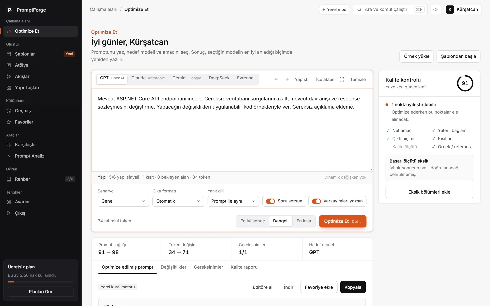

# PromptForge

Yapay zekâya yazdığın promptu, kullanacağın modelin en iyi anladığı hâle getiren bir çalışma alanı. "Bunu daha iyi yap" gibi yarım yamalak istekler yerine bağlamı, kuralları ve çıktı biçimi belli promptlar yazmak için yapıldı. Her analizde neyin neden eksik olduğunu da anlatıyor; amaç sadece promptu düzeltmek değil, daha iyi prompt yazmayı öğretmek.

ASP.NET Core 8 Web API + SQL Server arka uç, sade HTML/CSS/JavaScript arayüz. Site ve API aynı adreste çalışıyor.



## Özellikler

- **Modele özel optimizasyon:** GPT, Claude, Gemini, DeepSeek veya evrensel. İçerik aynı kalıyor, biçim değişiyor: GPT için Markdown başlıkları, Claude için XML etiketleri ve önce bağlam, Gemini için etiketli satırlar ve görev en sonda, DeepSeek için sade paragraflar.
- **Üç hedef:** *En iyi sonuç* eksik bağlamı ve kalite ölçütlerini ekleyerek genişletir, *Dengeli* aynı uzunlukta düzenler, *En kısa* kuralları koruyarak kısaltır.
- **Canlı kalite kontrolü:** Yazarken 0–100 arası puan, eksik bölümler (amaç, bağlam, çıktı, kısıt…) ve "Eksik bölümleri ekle" butonu.
- **Prompt Analizi:** Promptu 6 ölçütte (netlik, bağlam, özgüllük, kısıtlar, çıktı biçimi, verimlilik) puanlar. Her geri bildirim promptun kendi cümlesine atıf yapar, yanında somut bir düzeltme önerisi ve iyileştirilmiş hâli olur.
- **Şablonlar:** 6 kategoride 24 hazır şablon (kod inceleme, hata ayıklama, açılış sayfası, toplantı özeti, çalışma planı…). Seçince `{{boşluklar}}` bir pencerede doldurulup editöre aktarılır.
- **Atölye, Akışlar, Yapı Taşları:** Elde prompt yoksa amacını seçip birkaç soruyu yanıtlayarak, çok adımlı işleri düzenlenebilir plana çevirerek ya da rol/bağlam/kısıt gibi parçaları tek tek birleştirerek prompt oluşturma.
- **Değişkenler:** `{{müşteri adı}}` gibi alanlar korunur; editördeki rozete tıklayınca hepsi tek pencerede doldurulur.
- **Geçmiş, favoriler, karşılaştırma:** Her optimizasyon kaydedilir. İki sürüm yan yana konup puan ve metin farkı görülebilir.
- **Hesap:** Kayıt, e-posta doğrulama kodu, şifremi unuttum bağlantısı, Google/Microsoft Authenticator ile iki adımlı doğrulama, hesabı silme. Mailler HTML şablonlu gider.
- **Aylık kota:** Ücretsiz planda ayda 50 optimizasyon/analiz. Kota dolunca ay başına kadar durur; aynı anda gelen isteklerle bile aşılamaz.
- **Yedek motor:** AI anahtarı yoksa ya da sağlayıcı hata verirse tarayıcıdaki kural motoru devreye girer, kullanıcı boş ekran görmez. Gemini'de bir modelin kotası dolarsa istek sıradaki modele gider.
- **Rehber ve tanıtım turu:** "Başlarken" görev listesi, hangi aracın ne zaman kullanılacağı, zayıf/güçlü örneklerle iyi prompt dersleri. Yeni hesaplarda ilk girişte 3 adımlık tur açılır.
- **Rahat kullanım:** Açık/koyu tema, `Ctrl+K` komut paleti, `Ctrl+Enter` ile optimize, `Ctrl+Shift+C` ile kopyala, odak modu, `.txt`/`.md` dosyası sürükle-bırak. Telefonda da çalışır.

## Kurulum

Gerekenler: [.NET 8 SDK](https://dotnet.microsoft.com/download/dotnet/8.0) ve SQL Server (Express yeterli).

```bash
git clone https://github.com/kursatcnk/prompt-forge.git
cd prompt-forge
dotnet run --launch-profile http
```

Tarayıcıda `http://localhost:5299` açılır. Veritabanı tabloları ilk açılışta kendiliğinden oluşur.
Bağlantı adresi `appsettings.json` → `ConnectionStrings:DefaultConnection` içinde (varsayılan `localhost\SQLEXPRESS`).

Visual Studio ile: `PromptForge.sln` → profil olarak **http** → `Ctrl+F5`.

### AI anahtarı

Anahtar olmadan da çalışır, sadece yerel kural motoru kullanılır ve üst barda **Yerel mod** yazar. Gerçek AI için en az bir anahtarı **user secrets** ile ekle (proje klasörünün dışında durur, GitHub'a gitmez):

```bash
dotnet user-secrets set "AI:Gemini:ApiKey" "..."
```

Desteklenenler: `AI:Anthropic:ApiKey`, `AI:OpenAI:ApiKey`, `AI:Gemini:ApiKey`, `AI:DeepSeek:ApiKey`. Seçilen hedef modelin anahtarı varsa o, yoksa tanımlı ilk sağlayıcı kullanılır. Model adları `appsettings.json` → `AI` bölümünde.

### E-posta

SMTP ayarı yoksa mailler gönderilmez, içerikleri (doğrulama kodu, sıfırlama linki) terminale yazılır. Gerçek gönderim için, Gmail örneği (Google hesabından "uygulama şifresi" almak gerekir):

```bash
dotnet user-secrets set "Email:Smtp:Host" "smtp.gmail.com"
dotnet user-secrets set "Email:Smtp:Port" "587"
dotnet user-secrets set "Email:Smtp:Username" "adres@gmail.com"
dotnet user-secrets set "Email:Smtp:Password" "uygulama-sifresi"
dotnet user-secrets set "Email:Smtp:From" "adres@gmail.com"
```

### Arkadaşlarla denemek

`Paylas.bat` API'yi ve bir Cloudflare tünelini açar; tünel penceresindeki `https://….trycloudflare.com` linki paylaşılır. Hesap açmak gerekmez ama bilgisayar açık kaldıkça çalışır ve her açılışta link değişir. ([cloudflared](https://developers.cloudflare.com/cloudflare-one/connections/connect-networks/downloads/) kurulu olmalı.)

### Sunucuya yayınlama

Canlı ayarlar `appsettings.Production.json` dosyasında durur (bağlantı adresi, JWT anahtarı, AI ve SMTP). Dosya `.gitignore`'da, GitHub'a gitmez ama yayınlarken sunucuya kopyalanır. Windows/IIS destekli bir hosting'te (ör. MonsterASP.NET) Visual Studio → **Publish** yeterli.

## Teknik taraf

| | |
|---|---|
| Arka uç | ASP.NET Core 8 Web API, Entity Framework Core 8, SQL Server |
| Kimlik | JWT (httpOnly çerezde), antiforgery, BCrypt, TOTP (Otp.NET), QR (QRCoder), Data Protection |
| AI | Anthropic C# SDK, OpenAI/DeepSeek chat completions, Gemini REST |
| Arayüz | Framework'süz HTML, CSS, JavaScript |

```
Controllers/     API uçları (auth, account, prompts, favorites)
Services/        iş mantığı: kullanıcı, kota, kodlar, 2FA, e-posta, arka plan temizliği
Services/Ai/     sağlayıcı adaptörleri, optimize ve analiz servisleri
Models/, Data/   tablolar, DbContext, migration'lar
Dtos/            API'ye gelen ve dönen veri
wwwroot/         index.html tanıtım sayfası, app.html uygulama, auth/ giriş sayfaları
```

Bazı detaylar:

- JWT tarayıcıda `HttpOnly`, `SameSite=Strict` bir çerezde durur (https'te `Secure`), JavaScript token'ı göremez. Çerezle gelen değiştirici isteklerde `X-CSRF-TOKEN` başlığı doğrulanır; çıkışta çerezi sunucu siler. Swagger ve dış istemciler `Authorization: Bearer` başlığıyla çalışmaya devam eder.
- Şifreler BCrypt, tek kullanımlık kodlar SHA-256 ile saklanır; 2FA secret'ları şifreli, anahtarları veritabanında.
- Giriş/kayıt/şifre işlemleri IP başına, AI istekleri kullanıcı başına dakikalık sınırlı.
- Kota, SQL Server `sp_getapplock` ile kullanıcı başına kilitlenerek sayılır; son hakta paralel istekler yarışamaz.
- Arka planda eski kodları ve yarım kalan kota rezervasyonlarını temizleyen bir servis çalışır.
- `/health` uygulamanın ve veritabanı bağlantısının durumunu döner.

## Yapılacaklar

- Ödeme sistemi (Pro plan şu an "Yakında")
- Yönetici paneli
- Gizlilik ve kullanım şartları sayfaları

## Lisans

[MIT](LICENSE)
